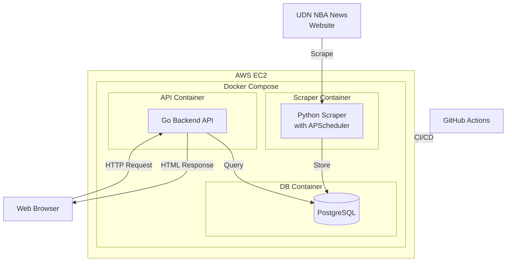

# NBA News Scraper Demo

A web scraping and news display system that collects NBA news from UDN Sports (tw-nba.udn.com) and presents them through a clean web interface.

## Architecture




## Tech Stack

- **Backend**: Go (Gin Framework)
- **Database**: PostgreSQL
- **Scraper**: Python
- **Infrastructure**: Docker

## Features

- Automated web scraping of NBA news from UDN Sports
- API for news retrieval
- PostgreSQL database for data persistence
- Containerized deployment with Docker
- Environment-based configuration

## Setup Instructions

### Prerequisites

- Docker and Docker Compose
- Python 3.12+
- Go 1.21+

### Environment Setup

1. Clone the repository:

    ```bash
    git clone <repository-url>
    cd nba-news-scraper
    ```

2. Set up environment variables:
    Create a `.env` file in the root directory with the following content:

    ```env
    POSTGRES_DB=your_db_name
    POSTGRES_USER=your_user
    POSTGRES_PASSWORD=your_password
    POSTGRES_PORT=5432
    ```

3. Start all services using Docker Compose:

    ```bash
    docker compose up -d
    ```

## API Documentation

### News Endpoints

#### Get Featured News List

```text
GET /index
```

Returns a list of featured news articles.

Response:

```json
{
  "data": [
    {
      "id": "string",
      "title": "string",
      "published_at": "datetime"
    }
  ]
}
```

#### Get News Detail

```text
GET /story/{id}
```

Returns detailed information about a specific news article.

Response:

```json
{
  "data": {
    "id": "string",
    "title": "string",
    "content": "string",
    "url": "string",
    "published_at": "datetime"
  }
}
```

## Project Structure

```bash
.
├── backend/           # Go backend service
├── database/         # Database related files
├── scraper/         # Python scraping service
└── docker-compose.yaml
```
