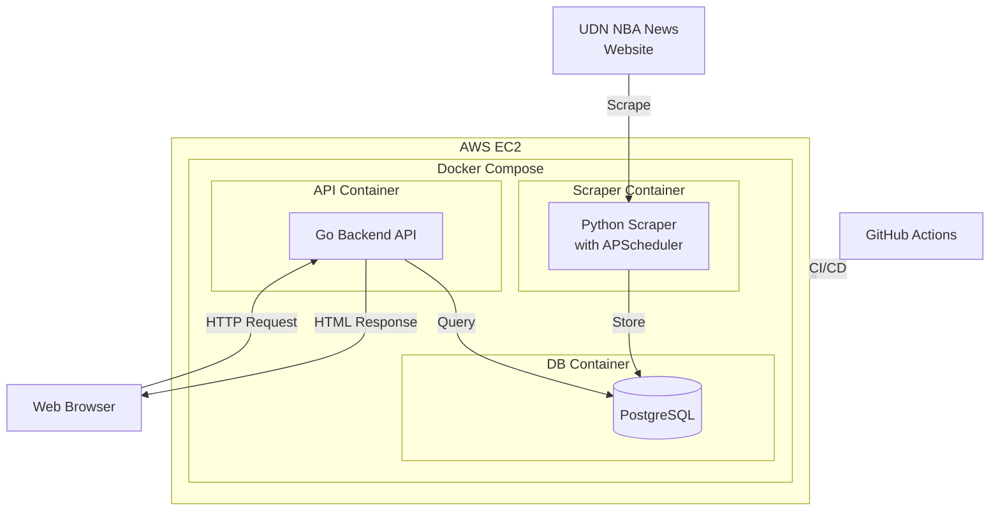

# NBA News Scraper

A web scraping and news display system that collects NBA news from UDN Sports (tw-nba.udn.com) and presents them through a clean web interface.

## Architecture

```mermaid
graph TB
    UDN[UDN NBA News<br/>Website] -->|Scrape| Scraper
    
    subgraph AWS[AWS EC2]
        subgraph Docker Compose
            subgraph Scraper Container
                Scraper[Python Scraper<br/>with APScheduler]
            end
            subgraph API Container
                API[Go Backend API]
            end
            subgraph DB Container
                DB[(PostgreSQL)]
            end
            Scraper -->|Store| DB
            API -->|Query| DB
        end
    end

    Client[Web Browser] -->|HTTP Request| API
    API -->|HTML Response| Client

    GitHub[GitHub Actions] -->|CI/CD| AWS
```